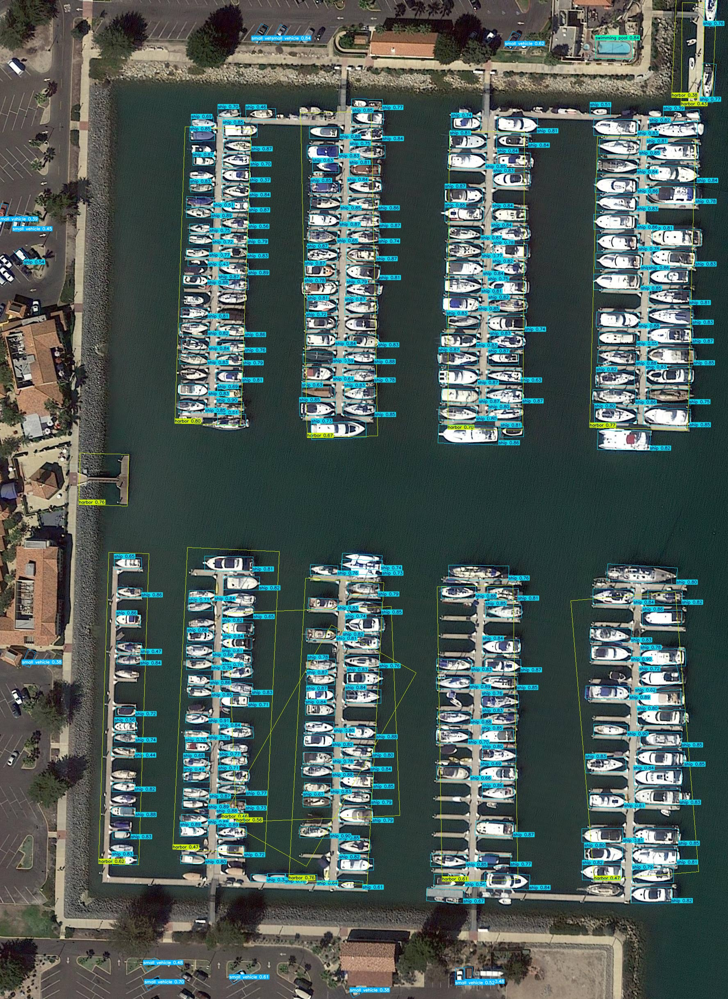

# YOLOv12-DINO3 OBB (Oriented Bounding Box) Detection

This document describes the OBB (Oriented Bounding Box) detection capabilities added to the YOLOv12-DINO3 architecture. OBB detection is useful for detecting rotated objects in aerial imagery, document analysis, and other applications where object orientation matters.


*Example: OBB detection on aerial imagery showing rotated bounding boxes for ships and other objects*

## Overview

OBB detection extends standard object detection by predicting rotated bounding boxes with 5 parameters:
- `x_center`: Center x-coordinate (normalized 0-1)
- `y_center`: Center y-coordinate (normalized 0-1)
- `width`: Box width (normalized 0-1)
- `height`: Box height (normalized 0-1)
- `rotation`: Rotation angle in radians [-π/4, 3π/4]

## Available OBB Configurations

### P0-Only Architecture (Single DINO Preprocessing)
These models use DINO enhancement only at P0 (input preprocessing) level:

| Model | Config File | Scale | Use Case |
|-------|-------------|-------|----------|
| YOLOv12s-DINO3-OBB | `yolov12s-dino3-vitb16-p0only-obb.yaml` | Small | Fast inference |
| YOLOv12m-DINO3-OBB | `yolov12m-dino3-vitb16-p0only-obb.yaml` | Medium | Balanced |
| YOLOv12l-DINO3-OBB | `yolov12l-dino3-vitb16-p0only-obb.yaml` | Large | High accuracy |

### DualP0P3 Architecture (Recommended)
These models use dual DINO enhancement at P0 (input preprocessing) and P3 (backbone) levels:

| Model | Config File | Scale | Use Case |
|-------|-------------|-------|----------|
| YOLOv12s-DINO3-OBB | `yolov12s-dino3-vitb16-dualp0p3-obb.yaml` | Small | Fast inference |
| YOLOv12m-DINO3-OBB | `yolov12m-dualp0p3-dino3-vitb16-obb.yaml` | Medium | Balanced speed/accuracy |
| YOLOv12l-DINO3-OBB | `yolov12l-dino3-vitb16-dualp0p3-obb.yaml` | Large | High accuracy |

### Single-Scale Architecture
These models use DINO enhancement at P4 level only:

| Model | Config File | Scale | Use Case |
|-------|-------------|-------|----------|
| YOLOv12s-DINO3-OBB | `yolov12s-dino3-vitb16-single-obb.yaml` | Small | Fast inference |

### Dual-Scale Architecture
These models use DINO enhancement at P3 and P4 levels:

| Model | Config File | Scale | Use Case |
|-------|-------------|-------|----------|
| YOLOv12n-DINO3-OBB | `yolov12n-dino3-vitb16-dual-obb.yaml` | Nano | Lightweight/Edge |
| YOLOv12s-DINO3-OBB | `yolov12s-dino3-vitb16-dual-obb.yaml` | Small | Fast inference |
| YOLOv12l-DINO3-OBB | `yolov12l-dino3-vitb16-dual-obb.yaml` | Large | High accuracy |

All configuration files are located in: `ultralytics/cfg/models/v12/`

## Installation

No additional installation required. OBB support is built into the Ultralytics framework.

## Quick Start

### CLI Training

Use the `trainobb.py` CLI script for easy training:

```bash
# Basic training
python trainobb.py --model yolov12s-p0only --data path/to/dataset.yaml

# Train with custom settings (using included DOTAv1.yaml)
python trainobb.py --model yolov12m-dualp0p3 --data DOTAv1.yaml --epochs 200 --batch 8 --imgsz 1024

# Multi-GPU training
python trainobb.py --model yolov12l-p0only --data dataset.yaml --device 0,1,2,3 --batch 64

# Resume training
python trainobb.py --model yolov12s-dualp0p3 --data dataset.yaml --resume

# Custom experiment name
python trainobb.py --model yolov12m-p0only --data dataset.yaml --name my_experiment --project runs/custom
```

### CLI Inference

Use the `inferobb.py` CLI script for inference:

```bash
# Single image inference
python inferobb.py --weights runs/obb/exp/weights/best.pt --source test.jpg

# Folder inference with custom confidence
python inferobb.py --weights best.pt --source images/ --conf 0.3 --iou 0.5

# Video inference
python inferobb.py --weights best.pt --source video.mp4 --save

# Save results as text files
python inferobb.py --weights best.pt --source images/ --save-txt --save-conf

# High resolution inference
python inferobb.py --weights best.pt --source images/ --imgsz 1024 --device 0

# Filter specific classes
python inferobb.py --weights best.pt --source images/ --classes 0 1 2
```

#### Available CLI Model Options (Training)

| CLI Model Name | Description |
|----------------|-------------|
| `yolov12s-p0only` | YOLOv12s with P0 preprocessing only |
| `yolov12s-single` | YOLOv12s with single DINO at P4 |
| `yolov12s-dualp0p3` | YOLOv12s with dual DINO at P0+P3 |
| `yolov12s-dual` | YOLOv12s with dual DINO at P3+P4 |
| `yolov12m-p0only` | YOLOv12m with P0 preprocessing only |
| `yolov12m-dualp0p3` | YOLOv12m with dual DINO at P0+P3 |
| `yolov12l-p0only` | YOLOv12l with P0 preprocessing only |
| `yolov12l-dualp0p3` | YOLOv12l with dual DINO at P0+P3 |
| `yolov12l-dual` | YOLOv12l with dual DINO at P3+P4 |
| `yolov12n-dual` | YOLOv12n with dual DINO at P3+P4 |

#### Training CLI Arguments

```bash
python trainobb.py --help
```

| Argument | Default | Description |
|----------|---------|-------------|
| `--model`, `-m` | Required | Model variant to train |
| `--data`, `-d` | Required | Path to dataset YAML file |
| `--epochs`, `-e` | 100 | Number of training epochs |
| `--batch`, `-b` | 16 | Batch size |
| `--imgsz` | 640 | Image size |
| `--device` | "0" | Device to use |
| `--workers` | 8 | Number of workers |
| `--optimizer` | "AdamW" | Optimizer |
| `--lr0` | 0.001 | Initial learning rate |
| `--patience` | 50 | Early stopping patience |
| `--project` | "runs/obb" | Project directory |
| `--name` | auto | Experiment name |
| `--resume` | False | Resume training |

#### Inference CLI Arguments

```bash
python inferobb.py --help
```

| Argument | Default | Description |
|----------|---------|-------------|
| `--weights`, `-w` | Required | Path to model weights |
| `--source`, `-s` | Required | Image/video/folder path |
| `--imgsz` | 640 | Image size |
| `--conf` | 0.25 | Confidence threshold |
| `--iou` | 0.7 | IoU threshold for NMS |
| `--max-det` | 300 | Maximum detections per image |
| `--device` | "0" | Device to use |
| `--save` | True | Save results |
| `--save-txt` | False | Save results as text files |
| `--save-conf` | False | Include confidence in text |
| `--save-crop` | False | Save cropped detections |
| `--show` | False | Display results |
| `--project` | "runs/obb/predict" | Project directory |
| `--name` | "exp" | Experiment name |
| `--classes` | None | Filter by class indices |

### Python API

#### 1. Load Model

```python
from ultralytics import YOLO

# Load OBB model configuration
model = YOLO("ultralytics/cfg/models/v12/yolov12m-dualp0p3-dino3-vitb16-obb.yaml")

# Or load pre-trained weights
model = YOLO("path/to/trained/weights.pt")
```

#### 2. Train Model

```python
from ultralytics import YOLO

model = YOLO("ultralytics/cfg/models/v12/yolov12m-dualp0p3-dino3-vitb16-obb.yaml")

results = model.train(
    data="path/to/obb_dataset.yaml",
    epochs=100,
    imgsz=640,
    batch=16,
    device="0",
    project="runs/obb",
    name="yolov12-dino3-obb"
)
```

#### 3. Validate Model

```python
from ultralytics import YOLO

model = YOLO("runs/obb/yolov12-dino3-obb/weights/best.pt")

metrics = model.val(
    data="path/to/obb_dataset.yaml",
    imgsz=640,
    batch=16
)

print(f"mAP50: {metrics.box.map50}")
print(f"mAP50-95: {metrics.box.map}")
```

#### 4. Run Inference

```python
from ultralytics import YOLO

model = YOLO("runs/obb/yolov12-dino3-obb/weights/best.pt")

results = model.predict(
    source="path/to/images",
    conf=0.25,
    iou=0.7,
    save=True,
    save_txt=True
)

# Process results
for result in results:
    if result.obb is not None:
        boxes = result.obb.xywhr  # [N, 5] - x, y, w, h, rotation
        confidences = result.obb.conf
        classes = result.obb.cls
        
        for box, conf, cls in zip(boxes, confidences, classes):
            x, y, w, h, r = box.tolist()
            print(f"Class: {int(cls)}, Conf: {conf:.2f}, "
                  f"Box: ({x:.1f}, {y:.1f}, {w:.1f}, {h:.1f}), "
                  f"Rotation: {r:.2f} rad")
```

#### 5. Export Model

```python
from ultralytics import YOLO

model = YOLO("runs/obb/yolov12-dino3-obb/weights/best.pt")

# Export to ONNX
model.export(format="onnx", imgsz=640)

# Export to TensorRT
model.export(format="engine", imgsz=640, half=True)
```

## Dataset Format

### YOLO OBB Format

Labels should be in YOLO OBB format with one `.txt` file per image:

```
class_id x_center y_center width height rotation
class_id x_center y_center width height rotation
...
```

Example:
```
0 0.5 0.5 0.2 0.1 0.785
1 0.3 0.7 0.15 0.08 1.57
```

- All values except `class_id` are normalized (0-1) relative to image dimensions
- `rotation` is in radians

### Dataset Configuration File

Create a YAML configuration file for your dataset:

```yaml
# obb_dataset.yaml
path: /path/to/dataset
train: images/train
val: images/val
test: images/test  # optional

names:
  0: class1
  1: class2
  2: class3
```

### Converting DOTA Dataset

DOTA is a popular benchmark for OBB detection. Convert it to YOLO format:

```python
from ultralytics.data.converter import convert_dota_to_yolo_obb

convert_dota_to_yolo_obb(
    dota_root_path="/path/to/DOTA",
    save_dir="/path/to/DOTA-YOLO"
)
```

DOTA dataset configuration:

```yaml
# dota.yaml
path: /path/to/DOTA-YOLO
train: images/train
val: images/val

names:
  0: plane
  1: ship
  2: storage-tank
  3: baseball-diamond
  4: tennis-court
  5: basketball-court
  6: ground-track-field
  7: harbor
  8: bridge
  9: large-vehicle
  10: small-vehicle
  11: helicopter
  12: roundabout
  13: soccer-ball-field
  14: swimming-pool
```

## Training Tips

### Recommended Hyperparameters

```python
model.train(
    data="obb_dataset.yaml",
    epochs=100,
    imgsz=640,
    batch=16,
    
    # Optimizer
    optimizer="AdamW",
    lr0=0.001,
    lrf=0.01,
    momentum=0.937,
    weight_decay=0.0005,
    
    # Augmentation
    hsv_h=0.015,
    hsv_s=0.7,
    hsv_v=0.4,
    degrees=0.0,      # Keep low for OBB
    translate=0.1,
    scale=0.5,
    shear=0.0,
    perspective=0.0,
    flipud=0.0,
    fliplr=0.5,
    mosaic=1.0,
    mixup=0.0,
    
    # Early stopping
    patience=50,
)
```

### Best Practices

1. **Image Size**: Use 640x640 or 1024x1024 for better rotation detection
2. **Batch Size**: Start with 8-16, adjust based on GPU memory
3. **Augmentation**: Be careful with rotation augmentation as it may conflict with OBB labels
4. **Learning Rate**: Start with 0.001 for AdamW
5. **Epochs**: Train for at least 100 epochs for good convergence

### Multi-GPU Training

```bash
# Using CLI
python trainobb.py --model yolov12l-dualp0p3 --data dota.yaml --device 0,1,2,3 --batch 64
```

```python
# Using Python API
model.train(
    data="obb_dataset.yaml",
    epochs=100,
    device="0,1,2,3",  # Use multiple GPUs
    batch=64           # Increase batch size accordingly
)
```

## Model Architecture

The OBB models use the same backbone as standard YOLOv12-DINO3 but replace the detection head with an OBB head:

```yaml
# Standard detection head
- [[16, 19, 22], 1, Detect, [nc]]

# OBB detection head
- [[16, 19, 22], 1, OBB, [nc, 1]]  # 1 = angle parameter
```

The OBB head adds an additional branch (`cv4`) to predict rotation angles for each detected object.

### P0-Only Architecture

```
Input Image
    |
    v
DINO3Preprocessor (P0) --- Enhanced input features
    |
    v
Standard YOLOv12 Backbone
    |
    +---> P3 Features
    |
    +---> P4 Features
    |
    +---> P5 Features
         |
         v
    FPN/PAN Neck
         |
         v
    OBB Detection Head ---> [x, y, w, h, rotation, class, conf]
```

### DualP0P3 Architecture

```
Input Image
    |
    v
DINO3Preprocessor (P0) --- Enhanced input features
    |
    v
YOLOv12 Backbone
    |
    +---> P3 Features ---> DINO3Backbone ---> Enhanced P3
    |
    +---> P4 Features
    |
    +---> P5 Features
         |
         v
    FPN/PAN Neck
         |
         v
    OBB Detection Head ---> [x, y, w, h, rotation, class, conf]
```

## Evaluation Metrics

OBB detection uses probabilistic IoU (probiou) for evaluation:

- **mAP50**: Mean Average Precision at IoU threshold 0.5
- **mAP50-95**: Mean Average Precision averaged over IoU thresholds 0.5 to 0.95
- **Precision**: True positives / (True positives + False positives)
- **Recall**: True positives / (True positives + False negatives)

## Troubleshooting

### Common Issues

1. **Model not detecting rotated boxes**
   - Ensure dataset labels are in correct OBB format
   - Check rotation values are in radians
   - Verify the task is set to "obb"

2. **CUDA out of memory**
   - Reduce batch size
   - Use smaller image size
   - Use gradient checkpointing

3. **Poor detection accuracy**
   - Train for more epochs
   - Increase image size
   - Use larger model variant
   - Check dataset quality and label accuracy

4. **Slow training**
   - Enable mixed precision: `amp=True`
   - Use multiple GPUs
   - Reduce image size

### Verification Script

Test your OBB model setup:

```python
from ultralytics import YOLO
import torch

# Test model loading
model = YOLO("ultralytics/cfg/models/v12/yolov12m-dualp0p3-dino3-vitb16-obb.yaml")
print(f"Model task: {model.task}")

# Test forward pass
device = "cuda" if torch.cuda.is_available() else "cpu"
model.model.to(device)
model.model.eval()

dummy_input = torch.randn(1, 3, 640, 640).to(device)
with torch.no_grad():
    output = model.model(dummy_input)

print("Forward pass successful!")
```

## File Structure

```
DINOV3-YOLOV12/
|-- trainobb.py                    # CLI training script
|-- inferobb.py                    # CLI inference script
|-- train_yolov12_dino_obb.py      # Python training script
|-- DOTAv1.yaml                    # DOTA v1.0 dataset configuration
|-- README_OBB.md                  # This documentation
+-- ultralytics/
    +-- cfg/
        +-- models/
            +-- v12/
                |-- yolov12s-dino3-vitb16-p0only-obb.yaml
                |-- yolov12s-dino3-vitb16-single-obb.yaml
                |-- yolov12s-dino3-vitb16-dualp0p3-obb.yaml
                |-- yolov12s-dino3-vitb16-dual-obb.yaml
                |-- yolov12m-dino3-vitb16-p0only-obb.yaml
                |-- yolov12m-dualp0p3-dino3-vitb16-obb.yaml
                |-- yolov12l-dino3-vitb16-p0only-obb.yaml
                |-- yolov12l-dino3-vitb16-dualp0p3-obb.yaml
                |-- yolov12l-dino3-vitb16-dual-obb.yaml
                +-- yolov12n-dino3-vitb16-dual-obb.yaml
```

## Complete DOTA Dataset Tutorial

This section provides a step-by-step guide to train and evaluate YOLOv12-DINO3 OBB models on the DOTA dataset.

### Step 1: Download DOTA Dataset

Download the DOTA dataset from the official website:
- [DOTA v1.0](https://captain-whu.github.io/DOTA/dataset.html)
- [DOTA v1.5](https://captain-whu.github.io/DOTA/dataset.html)
- [DOTA v2.0](https://captain-whu.github.io/DOTA/dataset.html)

Expected folder structure after download:
```
DOTA/
|-- train/
|   |-- images/
|   |   |-- P0001.png
|   |   |-- P0002.png
|   |   +-- ...
|   +-- labelTxt/
|       |-- P0001.txt
|       |-- P0002.txt
|       +-- ...
+-- val/
    |-- images/
    +-- labelTxt/
```

### Step 2: Convert DOTA to YOLO OBB Format

```python
from ultralytics.data.converter import convert_dota_to_yolo_obb

# Convert DOTA dataset to YOLO OBB format
convert_dota_to_yolo_obb(
    dota_root_path="/path/to/DOTA",
    save_dir="/path/to/DOTA-YOLO"
)
```

This will create:
```
DOTA-YOLO/
|-- images/
|   |-- train/
|   +-- val/
+-- labels/
    |-- train/
    +-- val/
```

### Step 3: Use Included Dataset Configuration

This repository includes a ready-to-use `DOTAv1.yaml` configuration file:

```yaml
# DOTAv1.yaml (included in repository)
path: DOTAv1  # dataset root dir
train: images/train  # train images (relative to 'path') 1411 images
val: images/val  # val images (relative to 'path') 458 images
test: images/test  # test images (optional) 937 images

# Classes for DOTA 1.0 (15 classes)
names:
  0: plane
  1: ship
  2: storage tank
  3: baseball diamond
  4: tennis court
  5: basketball court
  6: ground track field
  7: harbor
  8: bridge
  9: large vehicle
  10: small vehicle
  11: helicopter
  12: roundabout
  13: soccer ball field
  14: swimming pool

# Auto-download from Ultralytics assets
download: https://github.com/ultralytics/assets/releases/download/v0.0.0/DOTAv1.zip
```

The dataset will be automatically downloaded when you start training. If you prefer to create a custom configuration, use the format above.

For DOTA v1.5 (16 classes), add:
```yaml
  15: container-crane
```

For DOTA v2.0 (18 classes), add:
```yaml
  15: container-crane
  16: airport
  17: helipad
```

### Step 4: Train on DOTA

#### Using CLI (Recommended)

```bash
# Train YOLOv12s with P0-only DINO on DOTA (using included DOTAv1.yaml)
python trainobb.py --model yolov12s-p0only --data DOTAv1.yaml --epochs 100 --batch 16 --imgsz 1024

# Train YOLOv12m with DualP0P3 DINO on DOTA
python trainobb.py --model yolov12m-dualp0p3 --data DOTAv1.yaml --epochs 200 --batch 8 --imgsz 1024

# Train YOLOv12l with DualP0P3 DINO on DOTA (high accuracy)
python trainobb.py --model yolov12l-dualp0p3 --data DOTAv1.yaml --epochs 300 --batch 4 --imgsz 1024 --device 0,1

# Train with custom name
python trainobb.py --model yolov12m-p0only --data DOTAv1.yaml --epochs 150 --name dota_experiment --project runs/dota
```

#### Using Python API

```python
from ultralytics import YOLO

# Load model
model = YOLO("ultralytics/cfg/models/v12/yolov12m-dualp0p3-dino3-vitb16-obb.yaml")

# Train on DOTA using included DOTAv1.yaml
results = model.train(
    data="DOTAv1.yaml",
    epochs=200,
    imgsz=1024,  # DOTA images are high resolution
    batch=8,
    device="0",
    project="runs/dota",
    name="yolov12m-dino3-dota",
    
    # Recommended settings for DOTA
    optimizer="AdamW",
    lr0=0.001,
    lrf=0.01,
    
    # Augmentation (careful with rotation for OBB)
    degrees=0.0,
    translate=0.1,
    scale=0.5,
    fliplr=0.5,
    mosaic=1.0,
    
    # Early stopping
    patience=50,
)
```

### Step 5: Validate on DOTA

#### Using Python API

```python
from ultralytics import YOLO

# Load trained model
model = YOLO("runs/dota/yolov12m-dino3-dota/weights/best.pt")

# Validate on DOTA val set using included DOTAv1.yaml
metrics = model.val(
    data="DOTAv1.yaml",
    imgsz=1024,
    batch=8,
    conf=0.001,
    iou=0.7,
)

# Print metrics
print(f"mAP50: {metrics.box.map50:.4f}")
print(f"mAP50-95: {metrics.box.map:.4f}")
print(f"Precision: {metrics.box.p.mean():.4f}")
print(f"Recall: {metrics.box.r.mean():.4f}")

# Print per-class metrics
for i, name in enumerate(metrics.names.values()):
    print(f"{name}: mAP50={metrics.box.ap50[i]:.4f}, mAP50-95={metrics.box.ap[i]:.4f}")
```

### Step 6: Run Inference on DOTA Images

#### Using CLI

```bash
# Inference on single DOTA image
python inferobb.py --weights runs/dota/yolov12m-dino3-dota/weights/best.pt --source P0001.png --imgsz 1024

# Inference on folder of DOTA images
python inferobb.py --weights best.pt --source /path/to/dota/test/images/ --imgsz 1024 --conf 0.3 --save-txt

# High confidence inference
python inferobb.py --weights best.pt --source images/ --conf 0.5 --iou 0.5 --save-txt --save-conf
```

#### Using Python API

```python
from ultralytics import YOLO

# Load trained model
model = YOLO("runs/dota/yolov12m-dino3-dota/weights/best.pt")

# Run inference
results = model.predict(
    source="/path/to/dota/test/images/",
    imgsz=1024,
    conf=0.25,
    iou=0.7,
    save=True,
    save_txt=True,
    save_conf=True,
    project="runs/dota/predict",
    name="dota_results"
)

# Process results
for result in results:
    if result.obb is not None:
        print(f"\nImage: {result.path}")
        print(f"Detections: {len(result.obb)}")
        
        for i, (box, conf, cls) in enumerate(zip(result.obb.xywhr, result.obb.conf, result.obb.cls)):
            x, y, w, h, r = box.tolist()
            cls_name = result.names[int(cls)]
            print(f"  [{i}] {cls_name}: conf={conf:.3f}, "
                  f"center=({x:.1f}, {y:.1f}), size=({w:.1f}x{h:.1f}), "
                  f"rotation={r:.2f} rad ({r * 180 / 3.14159:.1f} deg)")
```

### Step 7: Export Results for DOTA Evaluation

For official DOTA evaluation, export predictions in DOTA format:

```python
from ultralytics import YOLO
import os

# Load model
model = YOLO("runs/dota/yolov12m-dino3-dota/weights/best.pt")

# Run inference with save_txt
results = model.predict(
    source="/path/to/dota/test/images/",
    imgsz=1024,
    conf=0.01,  # Low confidence for evaluation
    iou=0.7,
    save_txt=True,
    save_conf=True,
    project="runs/dota/submit",
    name="dota_submission"
)

# Results are saved in YOLO format
# Convert to DOTA submission format if needed for official evaluation
```

### DOTA Training Tips

1. **Image Size**: Use 1024x1024 or higher for DOTA (images are typically 4000x4000 pixels)

2. **Batch Size**: Start with 4-8 due to high resolution images

3. **Split Large Images**: For very large DOTA images, consider splitting:
   ```python
   # Use sliding window for large images
   from ultralytics.data.split_dota import split_trainval, split_test
   
   split_trainval(
       data_root="/path/to/DOTA",
       save_dir="/path/to/DOTA-split",
       split_size=1024,
       gap=200
   )
   ```

4. **Multi-scale Training**: Enable multi-scale for better performance:
   ```python
   model.train(
       data="dota.yaml",
       imgsz=1024,
       scale=0.5,  # Multi-scale range
       ...
   )
   ```

5. **Class Imbalance**: DOTA has class imbalance. Consider:
   - Focal loss (built-in)
   - Oversampling rare classes
   - Class-weighted loss

6. **Evaluation Protocol**: DOTA uses specific evaluation:
   - IoU threshold: 0.5
   - Per-class AP calculation
   - Official evaluation tools from DOTA website

### Expected Results on DOTA v1.0

| Model | mAP50 | mAP50-95 | Notes |
|-------|-------|----------|-------|
| YOLOv12s-P0only-OBB | ~65% | ~45% | Fast inference |
| YOLOv12m-DualP0P3-OBB | ~70% | ~50% | Balanced |
| YOLOv12l-DualP0P3-OBB | ~73% | ~53% | High accuracy |

*Note: Results may vary based on training settings and hardware.*

## References

- [DOTA Dataset](https://captain-whu.github.io/DOTA/)
- [DOTA Evaluation Tools](https://github.com/CAPTAIN-WHU/DOTA_devkit)
- [Probabilistic IoU Paper](https://arxiv.org/pdf/2106.06072v1.pdf)
- [Ultralytics OBB Documentation](https://docs.ultralytics.com/tasks/obb/)

## License

This project follows the Ultralytics AGPL-3.0 License.
